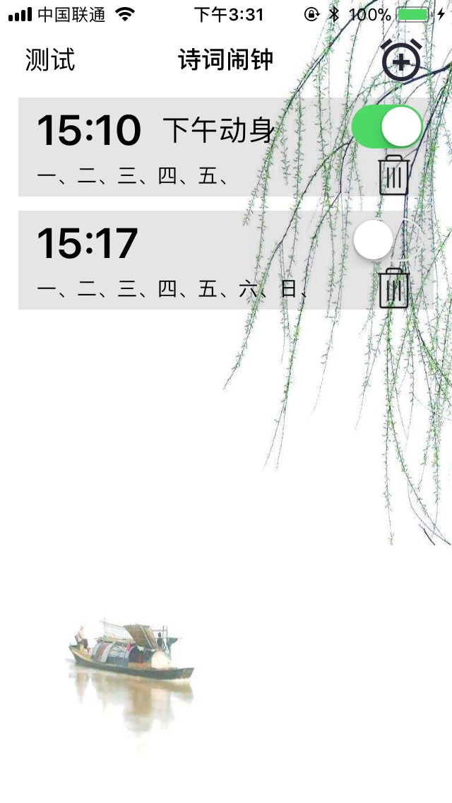
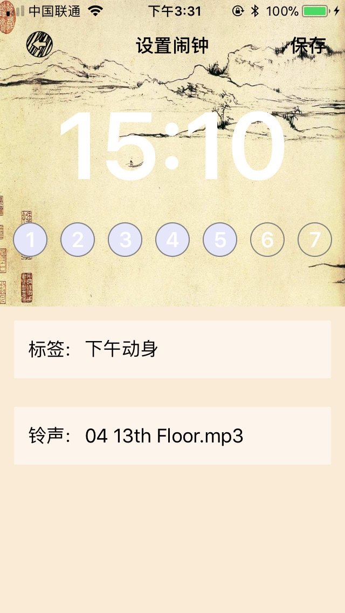
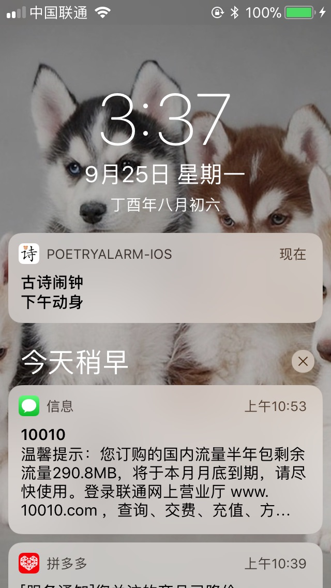

# PoetryAlarm-iOS

一个闹钟的Demo，将诗词做成闹钟的问题页面，只有正确输入了答案，才能停止闹钟

这个项目是学习swift练手的项目，最初的构思来自于计算闹钟，给早上不想起床的文艺青年设计。

截图：

    

### 项目目录：

* Utility - 工具类，分类和第三方的控件放在了这里
* Ringtone - 铃声文件
* Images - 图片
* Data - 数据模型

